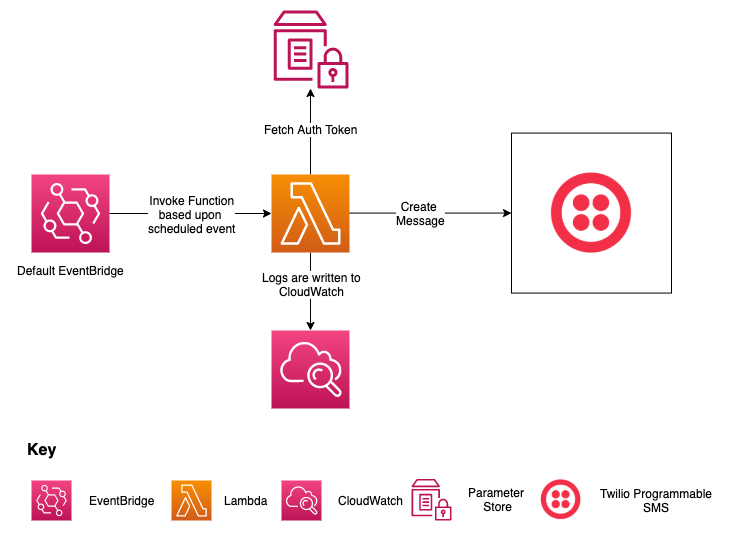

# Scheduled SMS Sender

This is an example lambda function that is invoked on a schedule to send an SMS to a phone number using AWS and Twilio. Feel free to modify the application code and infrastructure as code (Terraform) to meet your specific requirements.

The [lambda function](https://aws.amazon.com/lambda/) is written in [TypeScript](https://www.typescriptlang.org/) with tests written using the [Jest testing framework](https://jestjs.io/), the lambda is triggered by a scheduled event from [EventBridge](https://aws.amazon.com/eventbridge/) and fetches a the Twilio Auth Token from [AWS Systems Manager Parameter Store](https://docs.aws.amazon.com/systems-manager/latest/userguide/systems-manager-parameter-store.html) before sending an SMS to a phone number using [Programmable SMS](https://www.twilio.com/docs/sms) from Twilio.

This project uses [pnpm](https://pnpm.io/) as its package manager.



## Getting Started

To install the dependencies, please run the following command:

```sh
pnpm install
```

To run the tests, please run the following command:

```sh
pnpm run test
```

[esbuild](https://github.com/evanw/esbuild) is used to build the lambda artifact that is deployed to AWS Lambda. To build and zip the lambda artifact, please run the following command

```sh
pnpm run build
```

## Deploying the application

To be able to deploy the scheduled message sender onto AWS and start sending messages via Twilio, you need the following:

- [Twilio Account](https://www.twilio.com/) (with a phone number)
- [AWS Account](https://aws.amazon.com/)
- [AWS CLI](https://aws.amazon.com/cli/) (configured)
- [Terraform](https://www.terraform.io/) (v1.0 or above)
- Lambda artifact zip generated - see the instructions above on how to build the artifact

The Infrastructure as Code (IaC) for the scheduled message sender can be seen in the [infrastructure](./infrastructure) folder. The [README](./infrastructure/README.md) documents what resources will be provisioned/ configured and what data sources will be used to fetch data from AWS. The README also includes all the inputs that can be supplied to configure the scheduled message sender and the default value where appropriate.

These inputs can either be inputted when prompted, passed as a variable (`-var`) command-line argument i.e. `-var schedule_enabled=true` or specified in a Terraform variables file `*.tfvars` which can be passed to a Terraform command using the `-var-file` command-line argument i.e. `-var-file=<<path to variable file>>`.

To download the AWS provider, please run the following command

```sh
terraform -chdir=infrastructure init
```

To see what changes will be made, please run the following command

```sh
terraform -chdir=infrastructure plan
```

If you want to provision these resources on AWS, please run the following command (Please note cost/ charges may be incurred):

```sh
terraform -chdir=infrastructure apply
```

Then the resources should be provisioned

Once you are finished with the resources you can remove all the provisioned resources by running the following command

```sh
terraform -chdir=infrastructure destroy
```

Then the resources should be destroyed/ removed from AWS
